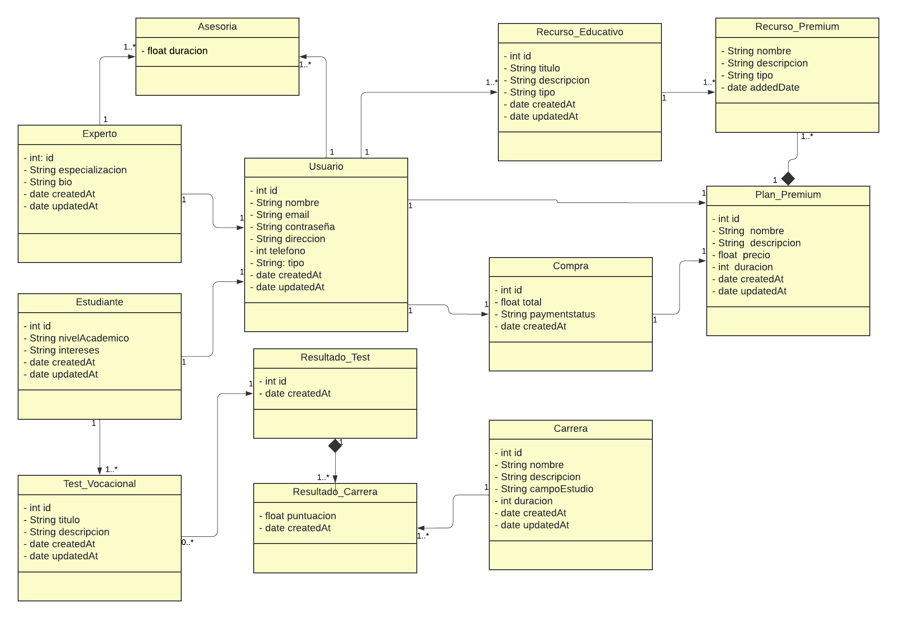
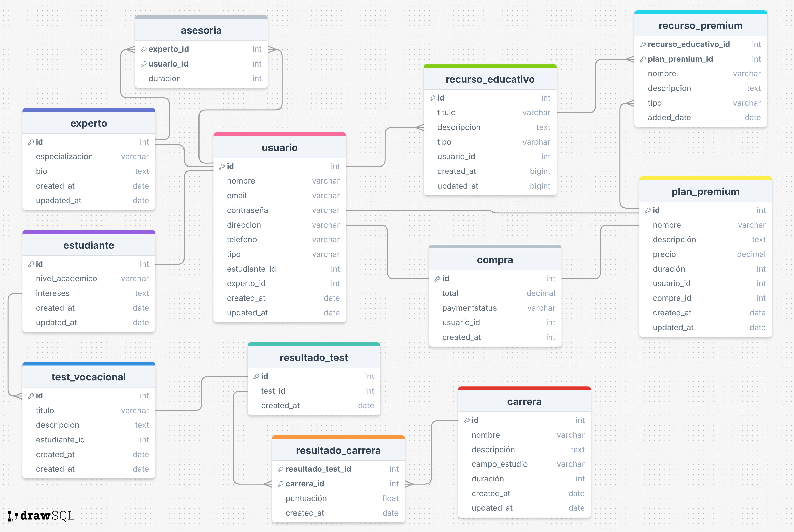

## Introducción

**VocatiON** es una innovadora aplicación web desarrollada para revolucionar la orientación vocacional y profesional de estudiantes y jóvenes profesionales. A diferencia de otras plataformas, VocatiON combina la asesoría personalizada con herramientas interactivas que facilitan la exploración y evaluación de carreras.

El propósito de VocatiON es proporcionar una plataforma integral que no solo facilite la toma de decisiones informadas sobre el futuro académico y profesional, sino que también ofrezca una experiencia de usuario intuitiva y accesible. La plataforma asegura una conexión efectiva entre estudiantes y expertos, facilitando la orientación vocacional de manera eficiente y personalizada, todo en un entorno seguro y amigable.
### Colaboradores del Proyecto

| **Nombre**                       | **Rol**            | 
|----------------------------------|--------------------|
| Bryan Steven Salvatierra Quesada | Líder del Proyecto |     
| Sergio Gabriel Celi Vertiz       |Programador|
| Jhon Kevin Castro Mendez         |Programador|
| Henry Alain Mondragon Tirado     |Programador|
| Raul Santiago Anton Figueroa     |Programador|

### Revisa el Progreso del Proyecto VocatiON

| **Columna**       | **Descripción**                                                                                                                                    |
|-------------------|----------------------------------------------------------------------------------------------------------------------------------------------------|
| **Backlog**       | Contiene todas las historias de usuario, tareas y características que deben desarrollarse. Es el listado de todo el trabajo pendiente.              |
| **En Progreso**   | Incluye las tareas que están actualmente en desarrollo. Visualiza el trabajo en curso para asegurar el flujo continuo de trabajo.                   |
| **Revisión**      | Después de completar una tarea, se mueve aquí para una revisión de código y revisión por pares (peer review). Esta fase incluye la creación de **pull requests** para asegurar que el código cumpla con los estándares de calidad antes de integrarse al proyecto principal. |
| **En Pruebas**    | Contiene las tareas que han pasado la revisión de código y necesitan pruebas exhaustivas (unitarias, de integración y de aceptación) para garantizar su calidad. |
| **Hecho**         | Las tareas completamente desarrolladas, revisadas y probadas se mueven aquí, indicando que están listas y finalizadas.                               |

### Funcionalidades de la Aplicación BookHub

#### **Módulo de Gestión de Usuarios**

- **Creación de Usuarios, Inicio de Sesión e Historial de Test:**
    - Permitir a los usuarios registrarse en la plataforma.
    - Facilitar el inicio de sesión para acceder a la cuenta personal.
    - Mantener la seguridad de las credenciales de los usuarios.
    - Facilitar al usuario recuperar su contraseña en caso de olvidarse.
    - Permitir al usuario eliminar su cuenta si lo requiere.
    - Permitir al usuario visualizar su Historial de Tests realizados.

#### **Módulo de Realización y Gestión de Test**

- **Creacion de Test Vocacionales**
    - Permitir al estudiante realizar un test vocacional.
    - Facilitar el guardado del test por si desea descarsar o haya alguna interrupción.
    - Permitir al estudiante descargar los test que ha realizado.
    - Generar test personalizados.

#### **Módulo de Conexión con Expertos**

- **Conectar a cada Estudiante con algun Experto:**
    - Añadir una seccion de busqueda de expertos.
    - Poder filtrar la busqueda de expertos.
    - Visualizar el perfil del experto.
    - Permitir agendar una sesion de asesoria.
    - Notificar las sesiones de asesoria acordadas.
    - Calificar las sesiones de asesoria.
    - Añadir un apartado para visualizar el historial de sesiones.

#### **Módulo de Recursos Educativos**

- **Acceso a todo tipo de Recurso Educativo:**
    - Permitir a los estudiantes buscar diferentes recursos educativos (videos, pdfs, asesorias).
    - Sugerir recursos educativos al estudiante.
    - Notificar al estudiante de posibles promociones.
    - Permitir al estudiante descargas guias educativas (PDF)
    - Recomendar recursos de acuerdo a los resultados de sus tests.
    - Permitir a usuarios Premium visualizar recursos exclusivos.

#### **Módulo de Gestion de Pagos en Linea**

- **Administrar las formas de Pago y compra:**
    - Crear un historial de compras realizadas por los estudiantes.
    - Añadir un metodo de pago.
    - Permitir eliminar un metodo de pago.
    - Facilitar la compra de asesorias a estudiantes con plan premium.
    - Notificar la confirmacion del pago realizado.

#### **Módulo de Gestion de Pagos en Linea**

- **Administrar los Planes Premium:**
  - Facilitar el acceso a planes exclusivos.
  - Permitir seleccionar el plan de su gusto.
  - Permitir poder actualizar de plan.
  - Agregar la funcion de poder cancelar la suscripcion.

## Diagramas de la Aplicación

Para entender mejor la estructura y diseño de la aplicación "VocatiON", revisa los siguientes diagramas:

### Diagrama de Clases

### Diagrama de Base de Datos

Este diagrama ilustra el esquema de la base de datos utilizada por la aplicación, mostrando las tablas, columnas, y relaciones entre las entidades.

### Descripción de Capas del Proyecto

| capa        | descripción                                                                                  |
|-------------|----------------------------------------------------------------------------------------------|
| api         | Contiene los controladores REST que manejan las solicitudes HTTP y las respuestas.            |
| entity      | Define las entidades del modelo de datos que se mapean a las tablas de la base de datos.      |
| repository  | Proporciona la interfaz para las operaciones CRUD y la interacción con la base de datos.      |
| service     | Declara la lógica de negocio y las operaciones que se realizarán sobre las entidades.         |
| service impl| Implementa la lógica de negocio definida en los servicios, utilizando los repositorios necesarios. |

# Asignación de Historias de Usuario

**Sprint 1:** Funcionalidades Básicas  

| Integrante                       | Módulo                       | Historia de Usuario                                     | Descripción                                                                                                          |
|----------------------------------|------------------------------|---------------------------------------------------------|----------------------------------------------------------------------------------------------------------------------|
| Sergio Gabriel Celi Vertiz       | Gestión de Usuarios        | Historia de Usuario 1: Registro de usuarios.            | Como usuario, quiero poder registrarme en la plataforma proporcionando mis datos y una contraseña.                   |
| Sergio Gabriel Celi Vertiz       | Gestión de Usuarios            | Historia de Usuario 2: Inicio de sesión.                | Como usuario registrado, quiero poder iniciar sesión en la plataforma ingresando mi correo electrónico y contraseña. |
| Bryan Steven Salvatierra Quesada | Gestión de Usuarios           | Historia de Usuario 3: Actualizacion de datos.          | Como usuario , quiero poder actualizar mis datos de preferencia.                                                     |
| Jhon Kevin Castro Mendez         | Gestión de Usuarios          | Historia de Usuario 4: Eliminar cuenta.                 |Como usuario registrado, quiero tener la opción de eliminar mi cuenta de manera permanente                                                                                                                      |
| Bryan Steven Salvatierra Quesada | Gestión de Usuarios           | Historia de Usuario 5: Recuperacion de contraseña.      | Como usuario que ha olvidado su contraseña, quiero poder iniciar un proceso de recuperación de contraseña de manera sencilla y segura                                                                                                                     |
| Henry Alain Mondragon Tirado     | Gestión de Usuarios           | Historia de Usuario 6: Historial de test realizados.    | Como usuario que ha realizado varios test de orientación vocacional, quiero poder acceder al "Historial de test realizados" desde mi perfil                                                                                                                     |
| Henry Alain Mondragon Tirado     | Realización y Gestión de Test          | Historia de Usuario 7: Realizacion de test vocacionales | Como usuario, quiero poder realizar un test vocacional que me ayude a identificar áreas profesionales que se alineen con mis intereses y habilidades                                                                                                                     |
| Raul Santiago Anton Figueroa     | Realización y Gestión de Test           | Historia de Usuario 8: Guardado de progreso de test     | Como usuario, quiero que mi progreso en el test vocacional se guarde automáticamente                                                                                                                     |
| Raul Santiago Anton Figueroa     | Realización y Gestión de Test | Historia de Usuario 9:  Descarga de test realizados     |  Como usuario que ha completado varios test de orientación vocacional, quiero poder descargar los resultados de los test realizados                                                                                                                    |
| Jhon Kevin Castro Mendez         | Recursos Educativos | Historia de Usuario 10: Visualizacion de Carreras       | Como usuario que busca información sobre opciones profesionales, quiero poder visualizar una lista de diferentes carreras disponibles en la plataforma                                                                                                                     |